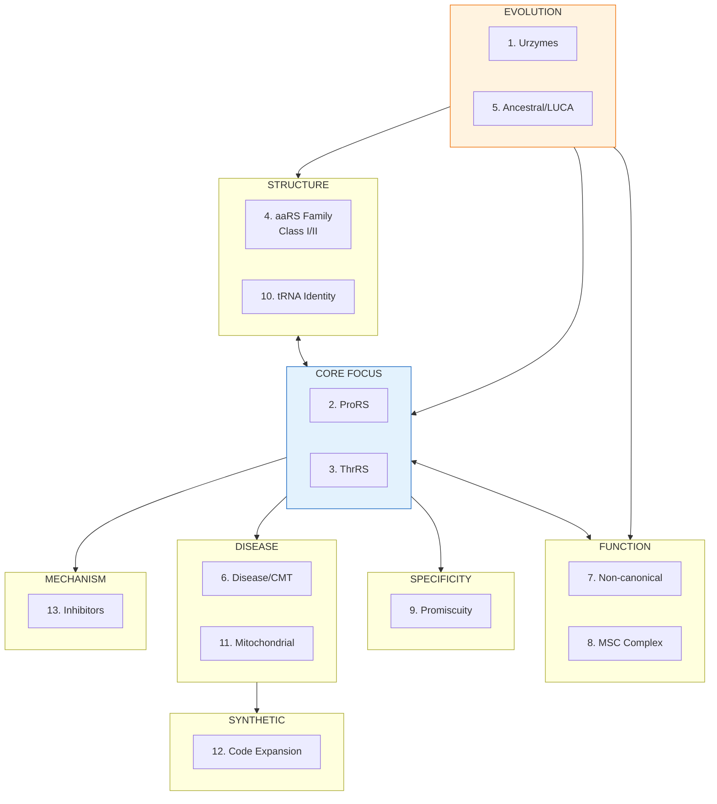

# aaRS Research Domain Flowchart - Complete 13 Networks

**Created:** 2026-01-17
**For publication use**

## Complete Research Map (13 Networks)

```
                              ┌─────────────────────┐
                              │     EVOLUTION       │
                              │  ─────────────────  │
                              │  1. Urzymes         │
                              │  5. Ancestral/LUCA  │
                              └──────────┬──────────┘
                                         │
           ┌─────────────────────────────┼─────────────────────────────┐
           │                             │                             │
           ▼                             ▼                             ▼
┌─────────────────────┐      ┌─────────────────────┐      ┌─────────────────────┐
│     STRUCTURE       │      │     CORE FOCUS      │      │      FUNCTION       │
│  ─────────────────  │      │  ─────────────────  │      │  ─────────────────  │
│  4. aaRS Family     │◄────►│  2. ProRS           │◄────►│  7. Non-canonical   │
│     (Class I/II)    │      │  3. ThrRS           │      │  8. MSC Complex     │
│  10. tRNA Identity  │      │                     │      │                     │
└─────────────────────┘      └──────────┬──────────┘      └─────────────────────┘
                                        │
           ┌────────────────────────────┼────────────────────────────┐
           │                            │                            │
           ▼                            ▼                            ▼
┌─────────────────────┐      ┌─────────────────────┐      ┌─────────────────────┐
│    SPECIFICITY      │      │       DISEASE       │      │     MECHANISM       │
│  ─────────────────  │      │  ─────────────────  │      │  ─────────────────  │
│  9. Promiscuity     │      │  6. Disease/CMT     │      │  13. Inhibitors     │
│     Misacylation    │      │  11. Mitochondrial  │      │      Drug design    │
└─────────────────────┘      └─────────────────────┘      └─────────────────────┘
                                        │
                                        ▼
                             ┌─────────────────────┐
                             │   SYNTHETIC BIOLOGY │
                             │  ─────────────────  │
                             │  12. Code Expansion │
                             │      PylRS, UAA     │
                             └─────────────────────┘
```

## Simplified Version (for figures)

```
                         ┌───────────┐
                         │ EVOLUTION │
                         │ Urzymes   │
                         │   LUCA    │
                         └─────┬─────┘
                               │
         ┌─────────────────────┼─────────────────────┐
         │                     │                     │
         ▼                     ▼                     ▼
   ┌───────────┐        ┌───────────┐        ┌───────────┐
   │ STRUCTURE │◄──────►│  ProRS    │◄──────►│ FUNCTION  │
   │ Class I/II│        │  ThrRS    │        │ MSC, Non- │
   │ tRNA ID   │        │           │        │ canonical │
   └───────────┘        └─────┬─────┘        └───────────┘
                              │
         ┌────────────────────┼────────────────────┐
         │                    │                    │
         ▼                    ▼                    ▼
   ┌───────────┐       ┌───────────┐       ┌───────────┐
   │SPECIFICITY│       │  DISEASE  │       │ MECHANISM │
   │Promiscuity│       │   Mito    │       │ Inhibitors│
   └───────────┘       └─────┬─────┘       └───────────┘
                             │
                             ▼
                      ┌───────────┐
                      │ SYNTHETIC │
                      │   Code    │
                      │ Expansion │
                      └───────────┘
```

## Mermaid Diagram (renders in GitHub/Notion)



## LaTeX/TikZ Version

```latex
\documentclass{standalone}
\usepackage{tikz}
\usetikzlibrary{positioning, shapes.geometric, arrows.meta}

\begin{document}
\begin{tikzpicture}[
    node distance=1.5cm and 2cm,
    box/.style={rectangle, draw, rounded corners, minimum width=2.8cm, minimum height=1.2cm, align=center, font=\small},
    mainbox/.style={box, fill=blue!15, line width=1pt},
    arrow/.style={-{Stealth}, thick},
    doublearrow/.style={{Stealth}-{Stealth}, thick}
]

% Evolution (top)
\node[box, fill=orange!20] (evol) {\textbf{EVOLUTION}\\Urzymes, LUCA};

% Middle layer
\node[box, below left=of evol, xshift=-1cm] (struct) {\textbf{STRUCTURE}\\Class I/II\\tRNA Identity};
\node[mainbox, below=of evol] (core) {\textbf{CORE FOCUS}\\ProRS, ThrRS};
\node[box, below right=of evol, xshift=1cm] (func) {\textbf{FUNCTION}\\Non-canonical\\MSC};

% Lower layer
\node[box, below left=of core, xshift=-1cm] (spec) {\textbf{SPECIFICITY}\\Promiscuity};
\node[box, below=of core] (disease) {\textbf{DISEASE}\\CMT, Mito};
\node[box, below right=of core, xshift=1cm] (mech) {\textbf{MECHANISM}\\Inhibitors};

% Bottom
\node[box, fill=green!15, below=of disease] (synth) {\textbf{SYNTHETIC}\\Code Expansion};

% Arrows
\draw[arrow] (evol) -- (struct);
\draw[arrow] (evol) -- (core);
\draw[arrow] (evol) -- (func);
\draw[doublearrow] (struct) -- (core);
\draw[doublearrow] (core) -- (func);
\draw[arrow] (core) -- (spec);
\draw[arrow] (core) -- (disease);
\draw[arrow] (core) -- (mech);
\draw[arrow] (disease) -- (synth);

\end{tikzpicture}
\end{document}
```

## Network Details Table

| # | Network | Focus | Key Seeds |
|---|---------|-------|-----------|
| 1 | **Urzymes** | Minimal enzymes, RNA world | Carter lab papers |
| 2 | **ProRS** | Prolyl-tRNA synthetase | Halofuginone, EPRS |
| 3 | **ThrRS** | Threonyl-tRNA synthetase | Zinc binding, editing |
| 4 | **aaRS Family** | Class I/II classification | Eriani 1990 partition |
| 5 | **Ancestral/LUCA** | Deep evolution | Pre-LUCA, genetic code |
| 6 | **Disease** | Clinical relevance | CMT, neurodegeneration |
| 7 | **Non-canonical** | Beyond translation | mTOR, angiogenesis |
| 8 | **MSC** | Complex assembly | Multi-synthetase |
| 9 | **Promiscuity** | Substrate selectivity | Misacylation, editing |
| 10 | **tRNA Identity** | Recognition elements | Identity rules |
| 11 | **Mitochondrial** | Organellar aaRS | mt-aaRS diseases |
| 12 | **Code Expansion** | Synthetic biology | PylRS, UAA |
| 13 | **Inhibitors** | Drug discovery | Mupirocin |

## Figure Caption (for paper)

**Figure X. Organizational framework of aminoacyl-tRNA synthetase research domains.**
Systematic mapping of aaRS literature into 13 interconnected thematic clusters.
The central focus on ProRS and ThrRS (blue) connects evolutionary origins (orange, top)
through structural classification and functional diversification to mechanistic
understanding, disease relevance, and synthetic biology applications (bottom).
Bidirectional arrows indicate strong cross-cluster citation relationships.
This framework was constructed using multi-seed RefNet citation network analysis,
discovering >100,000 papers across the complete aaRS research landscape.

## Methods Text (for paper)

> We constructed a comprehensive aaRS literature network using RefNet, a citation
> network analysis tool. Thirteen topic-focused seed sets were defined covering:
> evolutionary origins (urzymes, ancestral reconstruction, LUCA), structural
> classification (Class I/II, tRNA identity), core enzymes (ProRS, ThrRS),
> functional diversification (non-canonical roles, MSC assembly), substrate
> specificity (promiscuity, editing), disease associations (CMT, mitochondrial
> disorders), and biotechnology applications (genetic code expansion, inhibitor
> design). Each seed set initiated independent network expansion via citation
> crawling, with networks subsequently merged and deduplicated. The resulting
> unified network contains [X] unique papers and [Y] citation edges, representing
> the most comprehensive computational mapping of aaRS literature to date.

## Domain Relationship Matrix

```
             Evol  Struct  Core  Func  Spec  Disease  Mech  Synth
Evolution     ●      ◐      ◐     ○     ○      ○       ○      ○
Structure     ◐      ●      ●     ◐     ◐      ○       ◐      ○
Core Focus    ◐      ●      ●     ●     ●      ●       ●      ○
Function      ○      ◐      ●     ●     ○      ◐       ○      ○
Specificity   ○      ◐      ●     ○     ●      ○       ●      ○
Disease       ○      ○      ●     ◐     ○      ●       ◐      ◐
Mechanism     ○      ◐      ●     ○     ●      ◐       ●      ○
Synthetic     ○      ○      ○     ○     ○      ◐       ○      ●

● = strong connection, ◐ = moderate, ○ = weak/none
```

## Files

- Full config: `/storage/kiran-stuff/ref-network-app/AARS_RESEARCH_NETWORKS.md`
- Merge script: `/tmp/merge_aars_networks.py`
- Analysis: `/tmp/analyze_seed_importance.py`
